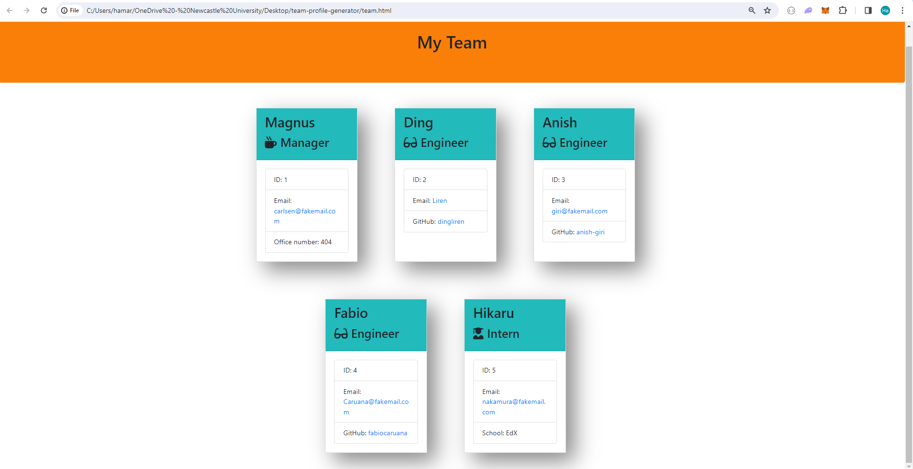

# Team profile generator

## Description

Team profile generator is a working Node.js command-line application. This application will take in information about employees on a software engineering team, then generates an HTML webpage that displays summaries for each person. Tests have been provided, and code has been assessed with the provided tests.

## Table of Contents

- [Description](#description)
- [User story](#user-story)
- [Installation](#installation)
- [Usage](#usage)
- [Visual](#visual)
- [Licence](#licence)

## User story
```
AS A developer, I want a team profile generator, so that I can quickly create a website to showcase all my team members.
```

## Installation

NPM Package Inquirer 6.5.0 and Jest library need to be installed before running the index.js file.

## Usage

User should know how to navigate or use the command prompt or terminal.

## Visual

A sample website "team.html" generated using the application is also attached in the repo. An image is attached to show the example of how the application works.



## Licence

[MIT](https://choosealicense.com/licenses/MIT)